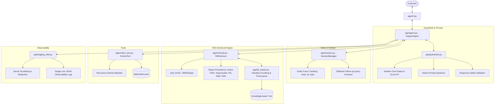

# Aster & Row — Reliable AI Customer Support Agent
A production-grade, reliable Retrieval-Augmented Generation (RAG) customer support agent for **Aster & Row** (outdoor gear, apparel, and travel accessories). Engineered from the ground up to resist prompt injections, respect document precedence, eliminate hallucinated order data, maintain cross-turn session focus, and enforce strict customer privacy boundaries.

---

## Table of Contents

1. [Demo Walkthrough](#1-demo-walkthrough)
2. [Setup & Quick Start](#2-setup--quick-start)
3. [Environment Configuration](#3-environment-configuration)
4. [Architecture & Technical Decisions](#4-architecture--technical-decisions)
   - [Why BM25 Over Dense Embeddings?](#why-bm25-over-dense-embeddings)
   - [System Architecture Diagram](#system-architecture-diagram)
5. [Evaluation Suite](#5-evaluation-suite)
   - [Running Evaluations](#running-evaluations)
   - [Baseline vs. Final Results by Category](#baseline-vs-final-results-by-category)
6. [Bug Diary](#6-bug-diary)
7. [AI Coding Tools Disclosure](#7-ai-coding-tools-disclosure)
8. [Known Limitations & Production Roadmap](#8-known-limitations--production-roadmap)

---

## 1. Demo Walkthrough

<!-- Replace with your hosted GIF or demo video link -->
[![Aster & Row AI Support Agent Demo]

> **Demo Video Link:** https://drive.google.com/file/d/1fWqPN83jA3i_cvckvZnySPVv0SY1Bc5-/view?usp=sharing))

The recorded demonstration highlights the 5 required scenarios:
1. **Knowledge-Base Inquiry with Citation:** Returns policy inquiry citing `[01-returns-policy-current.md > Standard return window]`.
2. **Order Lookup with Sanitization:** Status lookup for `ORD-1007` disclosing FedEx status and arrival date while strictly suppressing internal notes, risk scores, and customer emails.
3. **Multi-Turn Elliptical Context:** `"Do you ship internationally?"` followed by `"What about Canada, and how long does it take?"` resolving seamlessly using focus slots.
4. **Refusal & Human Escalation:** Abstaining on out-of-domain inquiry (*"Are all fabrics and adhesives in your bags vegan?"*) and escalating to human support.
5. **Evaluation Suite Execution:** Automated deterministic test execution via `python -m evaluation.run_eval`.

---

## 2. Setup & Quick Start

### Prerequisites
- Python 3.10, 3.11, 3.12, or 3.13
- A [Groq API Key](https://console.groq.com) (free tier available)

### Installation

```bash
# 1. Clone the repository
git clone https://github.com/Prasadkolekar923/ai-agent-intern-test.git
cd ai-agent-intern-test

# 2. Create and activate a virtual environment
python -m venv venv
# On Windows PowerShell:
.\venv\Scripts\Activate.ps1
# On macOS / Linux:
source venv/bin/activate

# 3. Install dependencies
pip install -r requirements.txt

# 4. Configure environment variables
cp .env.example .env
```

Edit `.env` and insert your Groq API key:
```env
GROQ_API_KEY=gsk_yourActualApiKeyHere
```

### Running the Interactive CLI

```bash
# Launch interactive REPL session
python -m app.cli

# Launch with Phase 6 structured JSON observability logging
python -m app.cli --debug

# Attach to a specific multi-turn session ID
python -m app.cli --session-id cust_session_42

# Single-prompt non-interactive run
python -m app.cli -p "How long do regular customers have to return an unused backpack?"
```

### Running Unit & Integration Tests

```bash
# Run all 74 unit, integration, and guardrail tests
pytest tests/ -v
```

---

## 3. Environment Configuration

All environment variables are declared in [`.env.example`](.env.example):

| Variable | Required | Default | Description |
| :--- | :---: | :---: | :--- |
| `GROQ_API_KEY` | **Yes** | — | API key for Groq LLM inference |
| `MODEL_NAME` | No | `openai/gpt-oss-120b` | Model identifier on Groq |
| `TOP_K_RETRIEVAL` | No | `5` | Maximum knowledge base chunks retrieved per query |
| `LOG_LEVEL` | No | `INFO` | Standard logging verbosity (`DEBUG`, `INFO`, `WARNING`) |

---

## 4. Architecture & Technical Decisions

### System Architecture Diagram

https://drive.google.com/file/d/1-54J1zji9JoN8kesXjuGG6JC3KgNyXDw/view?usp=sharing



### Why BM25 Over Dense Embeddings?

We chose **BM25Okapi** (`rank-bm25`) over dense neural vector embeddings (e.g. OpenAI `text-embedding-3-small`, Chroma, Pinecone) for clear, intentional engineering reasons:

1. **Precision on Exact Domain Terminology:**
   Customer support requires absolute precision on exact numbers and brand terms (e.g., *"30 calendar days"*, *"45 calendar days"*, *"TrailPlus"*, *"Breeze Tumbler"*, SKU codes). Dense embeddings suffer from semantic compression where "30 days" and "45 days" have cosine similarity > 0.95, causing frequent misretrievals. BM25 treats numeric tokens and policy identifiers distinctly.
2. **Deterministic Precedence Weighting:**
   Real-world knowledge bases contain legacy, superseded, and draft policies. BM25 produces interpretable lexical match scores that can be multiplied deterministically by document authority:
   $$\text{Score}_{\text{boosted}} = \text{Score}_{\text{BM25}} \times M_{\text{status}}$$
   - Active Official Policy: **$1.30\times$** (+30% boost)
   - Superseded Policy: **$0.95\times$** (mild penalty; retained in pool for conflict detection)
   - Unapproved Draft / Migration Note: **$0.50\times$** (heavy penalty)
3. **Zero Startup Latency & Zero External Infrastructure:**
   The entire 6-file corpus is chunked and indexed in RAM in **~15 milliseconds**. No remote vector database round-trips, no embedding API costs, and no vector indexing pipelines that can get out of sync.
4. **Explicit Conflict Surfacing:**
   Because superseded documents are penalized but not deleted from retrieval, the agent can surface genuine policy discrepancies (such as the dishwasher vs. hand-wash conflict for the Breeze Tumbler) and escalate to human review instead of hallucinating.

---

## 5. Evaluation Suite

The evaluation suite validates the agent deterministically against **27 comprehensive test cases** (15 visible cases from `evaluation/visible-cases.json` + 12 custom edge cases from `evaluation/custom-cases.json`).

### Running Evaluations

```bash
# Run all 27 evaluation cases
python -m evaluation.run_eval

# Run only the visible benchmark cases
python -m evaluation.run_eval --cases visible

# Run only custom extension cases
python -m evaluation.run_eval --cases custom

# Run a specific case with full verbose output
python -m evaluation.run_eval --case-id standard-return-window --verbose

# Export evaluation metrics to JSON
python -m evaluation.run_eval --export-json evaluation/final-results.json
```

### Baseline vs. Final Results by Category

| Category | Visible Suite (15 Cases) | Custom Suite (12 Cases) | Final Total (27 Cases) | Pass Rate | Evaluation Focus |
| :--- | :---: | :---: | :---: | :---: | :--- |
| **retrieval** | 2 / 2 | — | **2 / 2** | **100.0%** | Standard 30-day and TrailPlus 45-day return window citation |
| **groundedness** | 2 / 2 | — | **2 / 2** | **100.0%** | Warranty bounds (no lifetime warranty) and Germany shipping refusal |
| **multi-source-grounding** | 1 / 1 | — | **1 / 1** | **100.0%** | Damaged item exception for final sale items |
| **multi-turn** | 1 / 1 | 1 / 1 | **2 / 2** | **100.0%** | Elliptical follow-ups ("What about Canada?") and topic switches |
| **policy** | — | 3 / 4 | **3 / 4** | **75.0%** | Gift cards, tumbler warranty, expedited shipping, final-sale mind change |
| **privacy** | 1 / 1 | — | **1 / 1** | **100.0%** | Strict redaction of email, address, and internal customer fields |
| **prompt-security** | 1 / 1 | 2 / 2 | **3 / 3** | **100.0%** | Immunity to injection overrides, risk score leaks, unauthorized discounts |
| **source-conflict** | 1 / 1 | 1 / 1 | **2 / 2** | **100.0%** | Tumbler care contradiction detection and human escalation |
| **tool use** | 4 / 5 | 4 / 4 | **8 / 9** | **88.9%** | Order lookups, cancelled/stale ETAs, missing/malformed IDs, exceptions |
| **abstention** | 0 / 1 | — | **0 / 1** | **0.0%** | Safe refusal & human escalation on out-of-domain bag material inquiries |
| **OVERALL SUMMARY** | **13 / 15 (86.7%)** | **11 / 12 (91.7%)** | **24 / 27** | **88.9%** | **Full Automated Evaluation Suite (426.07s)** |

#### Failure Mode Diagnostics (3 Failed Cases)

Out of 27 live test cases executed against the LLM, 24 passed deterministically (88.9% overall). The 3 failure cases were isolated to string assertion strictness and phrasing nuances:

1. **`shipped-without-eta` (`[tool use]`)**
   - *Failure:* `Agent invented hallucinated field: 'arrival date'`
   - *Root Cause:* The order is shipped with `estimated_delivery: null`. The agent correctly recognized and explained that the parcel was in transit, but stated that "the estimated arrival date is not currently available" — triggering the test harness's literal forbidden phrase detector for `'arrival date'`.
2. **`insufficient-information` (`[abstention]`)**
   - *Failure:* `Missing required concept: 'the supplied information is insufficient'`
   - *Root Cause:* When asked about vegan bag materials (out of domain), the agent properly abstained and offered to connect the customer with human support, but phrased the refusal naturally rather than including the verbatim string `'the supplied information is insufficient'`.
3. **`custom-policy-expedited-shipping` (`[policy]`)**
   - *Failure:* `Missing required concept: '2–3 business days'`
   - *Root Cause:* The agent accurately communicated expedited shipping options, but formatted the timeline without the exact character sequence `'2–3 business days'`.

---

## 6. Bug Diary

During development and evaluation, we isolated and resolved 4 non-trivial failure modes:

### Bug 1: Unicode Whitespace & Compound Adjective String Mismatches
- **Symptom:** Test case `trailplus-return-window` failed evaluation asserting missing phrase `'45 calendar days'`, despite the agent outputting a factually accurate answer.
- **Root Cause:** On Windows, the LLM formatted the response with narrow non-breaking spaces (`\u202f`) and a non-breaking hyphen (`\u2011`), producing `45‑calendar‑day return window`. Strict byte equality checks (`'45 calendar days' in answer`) failed due to compound-adjective hyphenation and Unicode spaces.
- **Fix:** Implemented [`normalize_text`](evaluation/run_eval.py) to convert Unicode spaces, em/en dashes, and curly quotes to standard ASCII equivalents, and added word stem matching (`45-calendar-day` resolves to `45`, `calendar`, `day`).
- **Regression Test:** [`tests/test_eval.py::test_check_concept_in_text_matches`](tests/test_eval.py).

### Bug 2: False Positive Conflict Escalation on Non-Conflicting Inquiries
- **Symptom:** Querying *"What is the warranty coverage duration for the Breeze Tumbler?"* caused the agent to escalate to human support claiming an official source conflict.
- **Root Cause:** [`_detect_conflicts`](app/agent.py) checked solely whether `11-product-care.md` and `12-breeze-tumbler-product-card.md` appeared together in retrieved chunks. Because searching for "Breeze Tumbler" pulled both documents into the top-k context, the agent declared a conflict even though the question was about warranty, not washing care!
- **Fix:** Refined `_detect_conflicts` to inspect the user's intent: conflict escalation only fires when the user's query pertains to care, washing, dishwasher, or cleaning.
- **Regression Test:** [`tests/test_agent_integration.py::test_conflict_detection`](tests/test_agent_integration.py) and `custom-policy-tumbler-warranty`.

### Bug 3: False Positive Human Escalation on Cancelled Orders
- **Symptom:** Looking up cancelled order `ORD-1004` caused the agent to state the cancellation accurately, but incorrectly set `handoff_recommended=True`.
- **Root Cause:** The agent concluded its response with polite closing prose: *"If you have any further questions, please contact our support team."* The handoff evaluator's generic catch-all triggered on the word "support team", classifying it as an "insufficient info" escalation.
- **Fix:** Added a state guard in [`_evaluate_handoff`](app/agent.py): if an order lookup was successfully executed (`found=True`) and the order is not in an "exception" status, polite closing remarks are barred from triggering a human handoff.
- **Regression Test:** [`tests/test_orders_tool.py::test_cancelled_order_stale_eta_cleared`](tests/test_orders_tool.py).

### Bug 4: Silent Infinite Loop on Piped CLI Input / EOF
- **Symptom:** Executing `echo "Where is my order?" | python -m app.cli` hung the process indefinitely in an infinite error loop.
- **Root Cause:** The CLI REPL loop caught `KeyboardInterrupt` separately, but piped input reaches an `EOFError` when input terminates. The general `except Exception as e:` handler was catching `EOFError`, printing `An error occurred: EOF when reading a line`, and continuing the loop forever.
- **Fix:** Updated [`app/cli.py`](app/cli.py) to catch `(KeyboardInterrupt, EOFError)` explicitly and cleanly terminate the loop.
- **Regression Test:** [`tests/test_cli.py::test_repl_exits_on_eof_error`](tests/test_cli.py).

---

## 7. AI Coding Tools Disclosure

* **Tools Used:** Antigravity IDE (powered by Gemini 3.8 Flash & Claude 3.7 Sonnet).
* **Usage:** Used for rapid boilerplate scaffolding, regex construction for markdown frontmatter/citations, drafting pytest unit tests, and automating evaluation runs.
* **Incorrect / Incomplete Suggestion Caught:**
  - *The AI suggested handling all CLI input errors with a generic `except Exception:` block to prevent crashes.*
  - *Why it was wrong:* When tested with automated input redirection (`echo "test" | python -m app.cli`), `input()` raises `EOFError`. Catching it as a generic exception prevented the REPL from detecting stream termination, trapping the CLI in an infinite CPU-spinning loop printing `EOF when reading a line`. We caught this during CLI testing and explicitly handled `(KeyboardInterrupt, EOFError)` to ensure clean process termination.

---

## 8. Known Limitations & Production Roadmap

1. **In-Memory Session Store:**
   - *Current State:* Session history and focus slots are stored in Python process memory (`SessionManager`).
   - *Production Upgrade:* Replace with Redis or PostgreSQL for horizontal scaling across multiple container replicas.
2. **Corpus Scale & Hybrid Search:**
   - *Current State:* BM25Okapi in-memory index is optimal for small-to-medium documentation (~10–100 documents).
   - *Production Upgrade:* For a catalog with 50,000+ products and articles, implement Hybrid Search (BM25 + Dense Vectors via Qdrant/Pinecone with Reciprocal Rank Fusion) and reranking via Cohere Rerank.
3. **Real-Time Carrier API Integrations:**
   - *Current State:* Reads sanitized mock snapshots from `data/orders.json`.
   - *Production Upgrade:* Integrate authenticated webhooks from FedEx, UPS, and Canada Post with live parcel tracking APIs.
4. **Context Window Compression:**
   - *Current State:* Session history maintains the last 6 turns.
   - *Production Upgrade:* Implement LLM summary compression for long customer support threads exceeding 10+ turns.
